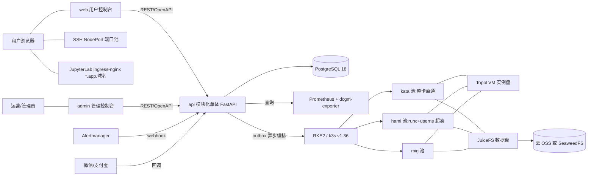

# SuperDL 架构参考

GPU 算力租赁平台的架构事实:技术栈、模块边界、数据模型、核心流程与硬约束。
各模块的接口契约见 [`reference/`](./reference/),UI/UX 规格见 [`ui-ux-spec.md`](./ui-ux-spec.md)。

## 1. 系统上下文



## 2. 技术栈

**后端**:Python 3.13(uv 管理)+ FastAPI 0.141.x + SQLAlchemy 2.0.x(async)+ asyncpg + Alembic + PostgreSQL 18;
定时与队列 APScheduler 3.11 + 自研事务性 outbox;K8s 客户端 `kubernetes` 36.x;支付 `wechatpayv3` 2.0.x +
`alipay-sdk-python` 3.7.x;观测 structlog + prometheus-client;质量闸门 ruff + pyright + pytest + import-linter。

**前端**:React 19.2 + Vite 8.x + Ant Design 6.6 + TanStack Router 1.x / Query 5.x + Zustand 5 + ECharts 6.1;
i18n 用 i18next 26 + react-i18next 17(zh-CN / en-US);工程链 pnpm 11 + Turborepo 2.x + ESLint/Prettier。antd 6
原生组件自封装,不引 `@ant-design/pro-components`;管理端监控图一律自绘(ECharts),Grafana 只作可选外链。

**平台层**:两档集群。**full** = RKE2 多机生产,全档位(dedicated/mig/shared);**light** = k3s 单机,仅共享档。发行版由
平台探测,业务侧无需声明。所有 chart 钉版本,升级走变更评审。

| 组件 | 版本 | 备注 |
|---|---|---|
| RKE2 / k3s | v1.36 | userns(`hostUsers: false`)GA |
| Cilium / GPU Operator | 1.20 / v26.3 | 仅 full 档;light 档用 k3s 内置 flannel + HAMi 直装 |
| Kata | 4.0 | RuntimeClass `kata-qemu`,VFIO 整卡直通 |
| HAMi | v2.9 | 共享档 CUDA 层软切分与限额 |
| kube-prometheus-stack | 88.x | Prometheus 本地留 15 天,长期数据进 PostgreSQL |
| JuiceFS CSI | 0.32.x(JuiceFS 1.4.x LTS) | 数据盘;后端云 OSS 或自建 SeaweedFS 4.4x |
| TopoLVM | chart 17.x | 实例盘本地 NVMe,销毁 `blkdiscard` |
| cert-manager / ingress-nginx | 1.19.x / chart 4.13.x | 泛域名证书与 Jupyter 北向入口 |

GPU 资源申请统一经 `app/core/gpu_adapter` 抽象:当前用 device-plugin 语法,切 DRA 只改这一层。

## 3. 模块化单体

```
apps/api/app/
├─ core/            # 配置、DB、JWT、审计、错误体、金额、时间、outbox、限流、策略与平台配置
│  ├─ gpu_adapter/  # GPU 资源申请抽象层
│  └─ k8s/          # base(接口)/ real(kubernetes 客户端)/ fake(dev 与测试)
├─ modules/
│  ├─ account/      # 注册登录、JWT、SSH 公钥、实名字段
│  ├─ catalog/      # SKU、镜像目录、库存近似查询、镜像预热
│  ├─ orchestrator/ # 实例状态机、K8s 编排、reconciler、SSH 端口池、数据盘
│  ├─ billing/      # 钱包、账本、小时结算、数据盘日结、余额巡检、支付渠道与回调、资金核对
│  ├─ metering/     # Prometheus 代理查询、usage_hourly 聚合
│  ├─ nodes/        # 节点注册(node-join.sh)、规格巡检、集群状态
│  ├─ notify/       # 短信 / 站内信 / Alertmanager webhook
│  └─ adminapi/     # 管理端 API,独立 JWT audience 与审计动作前缀
└─ workers/         # 同一镜像的第二入口:outbox worker + APScheduler 定时任务
```

模块之间只许 import 对方的 `service.py` 与 `schemas.py`,禁止跨模块 import 其他文件或跨模块查表;
唯一例外是 `account/deps.py`(全站鉴权依赖)。import-linter 契约逐文件列举强制。

对外契约 OpenAPI-first:FastAPI schema 导出 `openapi.json`,orval 生成 `packages/api-client`。用户 API
`/api/v1/*` 与管理 API `/api/admin/v1/*` 物理分离,独立 JWT audience、限流与审计动作前缀。

## 4. 控制面正确性的两根支柱

**支柱一:事务性 outbox。** 所有「改 DB + 动 K8s」的操作,在同一事务里完成业务写入与 `outbox_tasks` 插入,worker
用 `SELECT ... FOR UPDATE SKIP LOCKED` 领取后异步调 K8s(带重试、退避、死信)。「扣了费但没建资源」「建了资源但
没记账」由此在架构上不可能发生。

**支柱二:reconciler 对账循环。** 每 30s 比对「DB 期望状态 ↔ K8s 实际状态」(按租户 namespace 前缀 list):Pod 消失
而 DB 是 running → 记 `failed` 事件、停止计费并告警;Pod 存在而 DB 已 released → 强制删除并告警(泄漏等于白送算力);
`creating` 超时未调度 → 失败退款。reconciler 是状态漂移的兜底地板,不得关闭。

worker 侧其余定时任务:outbox 卡单回收、小时结算、数据盘日结、资金核对、usage 聚合、余额巡检、支付查单与超时关单、
镜像预热巡检、节点规格巡检与入网 reconciler、数据保洁。定时任务一律先抢 pg advisory lock,多副本下天然单实例执行。

## 5. 接入层

| 通道 | 机制 |
|---|---|
| SSH | 控制面维护端口池表 `port_allocations`,每实例分配一个 NodePort;仅密钥登录,禁密码。SSH 与 Jupyter 必须拆成两个 Service:`type=NodePort` 会给每个 port 都分配 NodePort,合并会让 Jupyter 随机占走端口池号段 |
| JupyterLab | 实例 Pod 内跑 JupyterLab(8888),`<instance>.app.<域名>` 泛域名 ingress-nginx 按 host 路由到 ClusterIP Service,token 由控制面注入,泛域名证书一张 |
| 安全边界 | 租户 Pod 默认拒东西向 NetworkPolicy,仅放行 Ingress Controller 到 8888;禁访节点网段 / Service 网段 / 云元数据;放行出公网。控制面 ServiceAccount 仅限 `tenant-*` namespace 前缀 |

## 6. 数据模型

`users` 一对多持有 `instances` / `data_disks` / `orders`,一对一持有 `wallets`;`skus` 定义实例规格;`instances` 派生
`instance_events`(状态流水)、`bills_hourly`(账单)、`usage_hourly`(指标聚合),并可挂载一块 `data_disks`(按日出 `bills_daily_disk`)。

| 模块 | 表 |
|---|---|
| account | `users` `ssh_keys` `used_refresh_tokens` `sms_codes` |
| catalog | `skus` `images` `image_node_cache` |
| orchestrator | `instances` `instance_events` `port_allocations` `data_disks` |
| billing | `wallets` `balance_ledger` `bills_hourly` `bills_daily_disk` `settlement_watermarks` `orders` |
| metering | `usage_hourly` |
| nodes | `node_enrollments` `node_specs` `cluster_status` |
| notify | `notifications` |
| adminapi | `admin_users` `admin_adjustments` |
| core | `outbox_tasks` `audit_log` `policy_overrides` `platform_settings` `rate_limit_counters` |

- 金额列一律 `numeric`:单价 `numeric(12,4)`,入账 `numeric(14,2)`。
- 结算幂等键:`bills_hourly` UNIQUE(instance_id, hour_start)、`bills_daily_disk` UNIQUE(disk_id, day)、`usage_hourly` UNIQUE(instance_id, hour_start)。
- 支付与创建幂等:`orders.channel_txn_id` / `order_no` 唯一;`orders`、`instances`、`data_disks` 均带
  UNIQUE(user_id, idempotency_key)。
- `instance_events`、`balance_ledger` 追加式不可改,后者带 `balance_after` 快照。
- `skus.oversell_cores` / `oversell_vram` 变更仅影响新实例;`data_disks.price_gb_month` 是创建时快照价,调价不追溯已有盘。

## 7. 核心流程

### 7.1 实例状态机

| 状态 | 允许迁移到 |
|---|---|
| creating | running(Pod Ready,计费开始)/ failed(调度或拉镜像超时,全额退)/ releasing(用户取消) |
| running | stopping(关机 / 欠费 / 到期)/ failed(pod_lost,仅系统) |
| stopping | stopped(Pod 删除,出尾账) |
| stopped | starting(校验余额)/ frozen(欠费)/ releasing(用户释放,二次确认) |
| starting | running / failed(库存不足) |
| frozen | stopped(充值解冻)/ releasing(宽限到期) |
| failed | releasing(清理失败实例) |
| releasing | released(擦盘完成,`blkdiscard`) |

`released` 是唯一终态。状态迁移只能经 `orchestrator/service.py` 的 transition 函数,同事务写 `instance_events`,禁止直接
UPDATE status。`stopped` 保留实例盘(节点本地 LV,重开机 pin 回原节点),数据盘照常计费。

### 7.2 创建实例

`POST /instances`(带 `Idempotency-Key`)在一个事务里校验余额 ≥ 1 小时预估费用,写 `instances(creating)` +
`instance_events` + `outbox_tasks`,立即返回 202。worker 领取任务后 ensure Namespace / NetworkPolicy / Quota /
JuiceFS PVC,再建 Pod(RuntimeClass 按档位、GPU 资源经 gpu_adapter、注入公钥与 jupyter token)、SSH 与 Jupyter 两个
Service、Ingress;Pod Ready 后同事务转 `running` 并写计费起点事件。超时未 Ready 转 `failed`,退款并清理。

### 7.3 小时结算

每小时 :02 触发(advisory lock 单实例执行),结算窗口由 `settlement_watermarks` 水位线推进,worker 重启或跨整点停机
漏掉的窗口下一轮自动补上(追平上限 72 小时 / 14 天,超出需人工补,`SETTLEMENT_LAG` 指标持续告警)。每个窗口扫
`instance_events` 重建 running 秒数 → 幂等 upsert `bills_hourly` → 同事务 `wallets` `FOR UPDATE` 扣减并写 `balance_ledger`。
离开 running 时由计费边监听器即时出尾账,与状态迁移同事务。数据盘每日 00:10 UTC 日结,00:30 UTC 跑资金核对(只报不改)。
usage 聚合独立运行:Prometheus 全挂,计费不停。

### 7.4 欠费与回收

余额巡检每 5 分钟一轮:预估可用时长低于 `low_balance_warn_hours`(默认 24h)→ 短信与站内预警;余额耗尽 → 停机出尾账
→ `frozen` 并倒计时 `freeze_grace_hours`(默认 72h)→ 到期 `releasing` → 删除 K8s 资源 → 实例盘 `blkdiscard` → `released`。
数据盘走独立时钟:欠费 7 天宽限(只读)→ 冻结 30 天 → 清除。天数与盘价都是可在线调整的策略参数(`policy_overrides`)。

## 8. 硬约束

1. **Kata 与 HAMi 不能共用同一批 GPU,必须分池。** HAMi 的 device plugin 与 Kata / KubeVirt 不兼容。节点池标签
   `superdl.io/pool` 装机时定死,RuntimeClass 的 nodeSelector 再兜一层:dedicated → kata 池;mig / shared_* → runc,
   分别落 mig / hami 池。
2. **计费主依据是 `instance_events`**(running↔非 running 的边);Prometheus 指标只做展示与对账,不参与计费。
3. **超卖分维度,且只发生在 HAMi 池;显存超卖 ≤1.2。** 整卡与 MIG 档不超卖。
4. **共享池与 MIG 池的 Pod 必须 `hostUsers: false`(userns)**,容器内 root 映射为宿主非特权 UID;Kata 档本身是
   VM 级隔离,不加 userns。
5. **数据盘独立于实例生命周期**:释放实例不删数据盘,关机也照常计费。

金额、时间、钱包加锁、outbox、状态机等编码级硬性规范见 `CLAUDE.md`。
