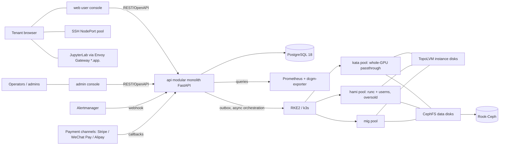
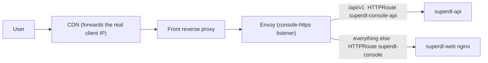

# SuperDL architecture reference

Stack, module boundaries, data model, core flows and hard constraints.
Module contracts live in [`reference/`](./reference/), the UI/UX spec in [`ui-ux-spec.md`](./ui-ux-spec.md), the documentation map in [`README.md`](./README.md).

## 1. System context



## 2. Stack

**Backend:** Python 3.13 (uv) + FastAPI + SQLAlchemy 2.0 (async) + asyncpg + Alembic + PostgreSQL 18; APScheduler + transactional outbox; the official `kubernetes` client; `stripe`, `wechatpayv3` and `alipay-sdk-python` payment SDKs; structlog + prometheus-client.

**Frontend:** React 19 + Vite + Ant Design 6 + TanStack Router / Query + Zustand + ECharts; i18next + react-i18next (en-US / zh-CN); pnpm + Turborepo. antd 6 primitives wrapped locally, no `@ant-design/pro-components`; admin monitoring charts are drawn in-house (ECharts), Grafana is only linked.

**Platform:** two cluster tiers. **full** = RKE2, multi-node production; **light** = k3s, single machine. Same component set; the only differences are k3s-side value overrides, and the distribution is probed by the platform.

Dependency versions are defined in `apps/api/pyproject.toml`, `package.json` and `deploy/cluster/helmfile.yaml.gotmpl`.

| Component               | Role                                                                                                                                                                                  |
| ----------------------- | ------------------------------------------------------------------------------------------------------------------------------------------------------------------------------------- |
| RKE2 / k3s              | Container platform; version follows the installer channel, the validation checklist expects v1.36.x                                                                                   |
| Cilium                  | Both tiers (CNI + NetworkPolicy + kube-proxy replacement + bandwidth limits); the light tier keeps the k3s ServiceLB for the north-south LoadBalancer                                 |
| GPU Operator            | Both tiers (NFD / GFD / DCGM / MIG / VFIO); the light tier disables the toolkit (the host toolkit is installed by the node baseline)                                                  |
| kata-deploy             | Both tiers, lands only on kata-pool nodes                                                                                                                                             |
| Kata                    | RuntimeClass `kata-qemu`, VFIO whole-GPU passthrough                                                                                                                                  |
| HAMi                    | CUDA-level soft partitioning and limits for the shared tier                                                                                                                           |
| kube-prometheus-stack   | Prometheus keeps 15 days locally; long-term data goes to PostgreSQL                                                                                                                   |
| Rook-Ceph + CephFS      | Data disks; one PVC per disk, the PVC size is the hard quota; supports idmapped mounts and therefore `hostUsers: false` tenant Pods                                                   |
| TopoLVM                 | Instance disks on local NVMe; destruction is an `lvremove` (lvmd `issue_discards=1`)                                                                                                  |
| Envoy Gateway           | The only north-south entry (Gateway API, `GatewayClass superdl`): three platform domains + tenant Jupyter wildcard + service-endpoint wildcard                                        |
| cert-manager + acme-dns | Certificates for the three platform domains and the wildcards (DNS01 via acme-dns); Gateway `certificateRefs` point at Certificates declared in `deploy/app/k8s/05-cert-manager.yaml` |

GPU resource request syntax is centralised in `app/core/gpu_adapter`; moving to DRA additionally means changing the PodSpec `resourceClaims` in `core/k8s/real.py`.

## 3. Modular monolith

```
apps/api/app/
├─ core/            # config, DB, JWT, audit, error body, money, time, outbox, rate limits, policies and platform config
│  ├─ gpu_adapter/  # GPU resource request abstraction
│  └─ k8s/          # base (interface) / real (kubernetes client) / fake (dev and tests)
├─ modules/
│  ├─ account/      # registration and login, JWT, SSH keys, identity verification
│  ├─ catalog/      # SKUs, image catalog, approximate inventory, image prewarming
│  ├─ orchestrator/ # instance state machine, K8s orchestration, reconciler, SSH port pool, data disks
│  ├─ services/     # online-service aggregate: deploy / stop / delete / keys, gateway auth callback, derived state
│  ├─ billing/      # wallet, ledger, hourly settlement, daily disk settlement, balance patrol, payment channels and callbacks, fund reconciliation
│  ├─ metering/     # Prometheus proxy queries, usage_hourly aggregation
│  ├─ nodes/        # node enrollment (node-join.sh), spec patrol, cluster status
│  ├─ notify/       # SMS / in-app messages / announcements / Alertmanager webhook
│  ├─ legal/        # legal document version flow and registration consents
│  ├─ tickets/      # ticket conversation flow and stale-ticket patrol
│  └─ adminapi/     # admin API, separate JWT audience and audit action prefix
└─ workers/         # second entry point of the same image: outbox worker + APScheduler jobs
```

Modules import only each other's public surface (`service.py` / `schemas.py`; `account/deps.py`, `account/deletion.py`; `orchestrator`'s `queries.py` / `transitions.py` / `statemachine.py` / `ports.py`). Dependency direction: `orchestrator/service.py → billing/service.py`; billing's settlement and patrols reach orchestration only through `orchestrator/queries.py` (read-only) and `orchestrator/transitions.py` (system-side stop / freeze / reclaim, data-disk arrears chain), neither of which depends on billing. Three import-linter contracts (`apps/api/pyproject.toml`) lock this; in-function imports appear only in `wiring.py`, process entry points and the payment adapters' on-demand third-party SDK loading (`payment_channels/alipay.py` / `wechat.py` / `stripe.py`, the only PLC0415 exemptions).

OpenAPI-first: the FastAPI schema is exported to `openapi.json` and orval generates `packages/api-client`. The user API `/api/v1/*` and the admin API `/api/admin/v1/*` are physically separate, with their own JWT audience, rate limits and audit action prefix.

## 4. Outbox and reconciler

**Transactional outbox.** "Change the DB and touch K8s" happens in one transaction: the business write and the `outbox_tasks` insert commit together; the worker claims tasks with `SELECT ... FOR UPDATE SKIP LOCKED` and calls K8s asynchronously (retries, backoff, dead letters). A task is claimable once `next_retry_at` has passed; `core/outbox.py`'s `enqueue(delay_seconds=...)` is the delayed-task primitive.

**Reconciler.** Every 30 s it compares the desired state in the DB with the actual state in K8s (listing by tenant namespace prefix): Pod gone while the DB says running → `failed`, billing stops and an alert fires; Pod present while the DB says released → force-deleted and alerted; `creating` timed out → failed and refunded. The reconciler must never be switched off.

Other scheduled worker jobs: stuck-outbox reaping, hourly settlement, daily disk settlement, fund reconciliation, usage aggregation, balance patrol, subscription expiry patrol, payment lookup and order expiry, image prewarm patrol, node spec patrol and enrollment reconciler, stale-ticket patrol, data cleanup. Each job first takes a PG advisory lock so it runs on one instance; the list and periods are in `apps/api/app/workers/jobs.py` (every job declares its worker component).

## 5. Access layer

| Channel                  | Mechanism                                                                                                                                                                                                                                                                                                                                                                                                                                                                                                                                                                                 |
| ------------------------ | ----------------------------------------------------------------------------------------------------------------------------------------------------------------------------------------------------------------------------------------------------------------------------------------------------------------------------------------------------------------------------------------------------------------------------------------------------------------------------------------------------------------------------------------------------------------------------------------- |
| SSH                      | Port-pool table `port_allocations`, one NodePort per instance; key-only login. **SSH and Jupyter are two separate Services** (SSH `NodePort`, Jupyter `ClusterIP`)                                                                                                                                                                                                                                                                                                                                                                                                                        |
| JupyterLab               | Port 8888 inside the Pod, **one HTTPRoute per instance** (tenant ns, attached to the `app-https` listener) routing by host to the ClusterIP Service; the token is injected by the control plane; one wildcard certificate                                                                                                                                                                                                                                                                                                                                                                 |
| Public service endpoints | Online services (`services`) are reachable at `<slug>.svc.<domain>`; a service owns one `workload_type='service'` revision instance, **one HTTPRoute per instance** on the `svc-https` listener. API keys are verified at the gateway (one `SecurityPolicy.extAuth` on the listener), user containers implement no auth; **auth results are not cached**, so the control plane is a synchronous dependency of every endpoint — see [reference/services.md](./reference/services.md)                                                                                                       |
| Tenant NetworkPolicy     | East-west denied by default. Ingress allows `envoy-gateway-system` (the Envoy data-plane ns, not `superdl`) **on any port**, plus TCP 22 from `0.0.0.0/0` **minus the Pod CIDR** (not the whole private range). Egress DNS is pinned to CoreDNS; public TCP excludes an abuse-port and data-store blacklist, UDP is an allow-list, private and cloud-metadata ranges are denied                                                                                                                                                                                                           |
| Gateway policies         | Source-IP allow-list (admin), edge rate limits (API domain, console domain `/api/v1`, admin routes — one each; anonymous callback routes get a stricter body limit), service-endpoint auth and rate limits, tenant Jupyter listener limits, global timeout / connection fallbacks and client-IP detection (`numTrustedHops`): 10 policy objects attached to the Gateway / HTTPRoutes (`deploy/app/k8s/04-gateway.yaml`). Attachment is by listener `sectionName`, **a typo does not error** — the clue is in the policy's `status.ancestors[].conditions`; the 6 listener names are fixed |

Control-plane ServiceAccounts are split per worker component; write access to tenant resources is a ClusterRole whose reach is narrowed by the **seven ValidatingAdmissionPolicies (all `Deny`)** in `deploy/cluster/admission/tenant-restrictions.yaml`: platform SA write scope (`superdl` / `tenant-*` namespaces and nodes), tenant Pod security baseline, field-level Node write allow-list, global Pod fallback, Secret-reference allow-lists for Pod and Job templates, Node deletion allow-list. Mechanics in [`reference/security.md`](./reference/security.md). The number of HTTPRoutes grows linearly with active instances and is the capacity variable of the Envoy data plane's memory.

### The real public path

The `api-https` listener (API domain) is not reachable from the public internet; the user console, the payment-channel callbacks and the Alertmanager webhook use the console domain, where `/api/v1` is routed by the HTTPRoute `superdl-console-api` straight to the API — the web nginx same-origin proxy only exists in compose / dev.



Invariant: every hop on this path (Envoy data-plane Pod CIDR, front-proxy egress, CDN origin ranges) must be listed both in the ConfigMap `FORWARDED_ALLOW_IPS` (`deploy/app/k8s/00-namespace-config.yaml`) and in `ClientTrafficPolicy superdl-gateway`'s `clientIPDetection.xForwardedFor.numTrustedHops`; miss one and the per-IP edge buckets, the admin allow-list and `audit_log.ip` all see that hop's address. The console-domain `/api/v1` route carries the same per-IP limits and 1 MiB body cap as the API domain (`superdl-console-api-ratelimit`) and the same edge 404 list (`superdl-console-edge-deny`); admin routes carry `superdl-admin-ratelimit`.

## 6. Data model

`users` own many `instances` / `data_disks` / `orders` and exactly one `wallets` row; `skus` define specs; `services` own many `instances` (each an immutable revision); `instances` derive `instance_events`, `bills_hourly`, `usage_hourly` and may attach one `data_disks` row (billed daily into `bills_daily_disk`).

| Module       | Tables                                                                                                                                                                                                          |
| ------------ | --------------------------------------------------------------------------------------------------------------------------------------------------------------------------------------------------------------- |
| account      | `users` `ssh_keys` `used_refresh_tokens` `verification_codes` `user_quota_overrides` `account_deletion_requests`                                                                                                |
| catalog      | `skus` `images` `image_node_cache`                                                                                                                                                                              |
| orchestrator | `instances` `instance_events` `port_allocations` `data_disks`                                                                                                                                                   |
| services     | `services` `service_api_keys`                                                                                                                                                                                   |
| billing      | `wallets` `balance_ledger` `bills_hourly` `bills_daily_disk` `subscriptions` `settlement_watermarks` `settlement_gaps` `reconcile_checkpoints` `orders` `invoice_requests` `refund_requests` `billing_identity` |
| metering     | `usage_hourly`                                                                                                                                                                                                  |
| nodes        | `node_enrollments` `node_specs` `cluster_status`                                                                                                                                                                |
| notify       | `notifications` `announcements`                                                                                                                                                                                 |
| legal        | `legal_doc_versions` `user_consents`                                                                                                                                                                            |
| tickets      | `tickets` `ticket_messages`                                                                                                                                                                                     |
| adminapi     | `admin_users` `admin_adjustments`                                                                                                                                                                               |
| core         | `outbox_tasks` `audit_log` `platform_settings` `rate_limit_counters`                                                                                                                                            |

- Money columns are always `numeric`: unit prices `numeric(12,4)`, booked amounts `numeric(14,2)`.
- Settlement idempotency keys: `bills_hourly` UNIQUE(instance_id, hour_start), `bills_daily_disk` UNIQUE(disk_id, day), `usage_hourly` UNIQUE(instance_id, hour_start).
- Payment and creation idempotency: `orders.channel_txn_id` / `order_no` unique; `orders`, `instances`, `data_disks` carry UNIQUE(user_id, idempotency_key).
- `instance_events` and `balance_ledger` are append-only; the latter carries `balance_after`; `balance_ledger.ref_type` has a CHECK allow-list (including `subscription`).
- **`instances.market` (on_demand / subscription / spot) is "how it is bought", `skus.tier` is "which tier is bought"; they are orthogonal** — no separate SKU for subscriptions. Prepaid subscriptions live in `subscriptions`: a renewal **inserts a new row** linked through `renewed_from_id`, the old row becomes expired.
- Subscription rows are UNIQUE(user_id, idempotency_key) for the **convert and renew** paths; replay lookups compare `subscriptions.request_fingerprint` (same key, different params → 409); the row created at order time carries no key and is protected by the `instances` row of the same transaction.
- Service endpoint credentials are stored as digests only: `service_api_keys.key_hash` unique (HMAC-SHA256), the plaintext appears once in the creation response, revocation writes `revoked_at`; `services.public_slug` is unique and is both the left-most public DNS label and the API path identifier; `instances.service_id` and `workload_type='service'` are both set or both unset (CHECK).
- `skus.oversell_cores` changes affect new instances only; `data_disks.price_gb_month` is a snapshot taken at creation.

## 7. Core flows

### 7.1 Instance state machine

| State     | May move to                                                                                                               |
| --------- | ------------------------------------------------------------------------------------------------------------------------- |
| creating  | running (Pod Ready, billing starts) / failed (scheduling or image-pull timeout, full refund) / releasing (user cancelled) |
| running   | stopping (shutdown / arrears / expiry / spot preemption) / failed (pod_lost, system only)                                 |
| stopping  | stopped (Pod deleted, tail bill issued) / releasing (hang timeout or user gave up)                                        |
| stopped   | starting (balance checked) / frozen (arrears) / releasing (user released)                                                 |
| starting  | running / failed (no capacity)                                                                                            |
| frozen    | stopped (top-up unfreezes) / releasing (grace expired)                                                                    |
| failed    | stopped (recovery restart, reusing the instance disk) / releasing                                                         |
| releasing | released (instance-disk LV deleted)                                                                                       |

`released` is the only terminal state. Transitions go only through the transition functions in `orchestrator/service.py` (request path) and `orchestrator/transitions.py` (system side: handlers, reconciler, preemption, patrols), both of which write `instance_events` in the same transaction. `stopped` keeps the instance disk (a node-local LV; restarts are pinned to the original node) and data disks keep billing.

### 7.2 Creating an instance

`POST /api/v1/instances` (with `Idempotency-Key`) checks, in one transaction, that the balance covers `afford_cover_hours` (default 1) of estimated cost, writes `instances(creating)` + `instance_events` + `outbox_tasks`, and returns 202. The worker ensures Namespace / NetworkPolicy / Quota, creates the Pod (RuntimeClass and GPU resource syntax dispatched by **node pool** through gpu_adapter, public keys and the Jupyter token injected), the SSH and Jupyter Services and the HTTPRoute; once the Pod is Ready the instance becomes `running` with a billing-start event; on timeout it becomes `failed`, is refunded and cleaned up. A subscription order additionally, in the same transaction, pre-debits the whole period and inserts a `subscriptions` row (§7.5).

### 7.3 Hourly settlement

**The billing source of truth is `instance_events`**; Prometheus metrics are for display and reconciliation only.

Triggered at :02 every hour (advisory lock); the settlement window advances through `settlement_watermarks`, missed windows are caught up next round (catch-up is capped; excess windows are recorded as gaps and alerted). Each window rebuilds running seconds from `instance_events` → idempotently upserts `bills_hourly` → debits `wallets` under `FOR UPDATE` and writes `balance_ledger` in the same transaction. Leaving `running` issues the tail bill immediately through the billing-edge listener, in the same transaction as the state transition. Daily disk settlement and fund reconciliation run on the **deployment's billing day** (00:10 / 00:30 in `SUPERDL_BILLING_TIMEZONE`, see `core/timeutil.billing_day_floor`); reconciliation only reports, never corrects. Details in [`reference/billing.md`](./reference/billing.md).

### 7.4 Arrears and reclamation

The balance patrol runs every 5 minutes: estimated remaining runtime below the warning threshold → SMS and in-app warning; balance exhausted → stop with a tail bill → `frozen` countdown → `releasing` → delete K8s resources → `lvremove` the instance disk → `released`. Data disks follow their own clock: grace (read-only) → frozen → purge. Day counts and disk price are online policy parameters (platform config `policy` group); values in [`reference/billing.md`](./reference/billing.md) and [`reference/disks.md`](./reference/disks.md).

### 7.5 Subscriptions (prepaid)

An order with `market='subscription'` pre-debits the whole period up front and is not settled hourly. Periods are **fixed hour counts** (day 24 / week 168 / month 720 / year 8760); discounts are four online policy parameters. Ordering, renewal and expiry live in `app/modules/billing/subscriptions.py`; discount and quote maths have one home, `app/core/pricing.py`.

Two ways into a subscription: buy one at creation, or convert a running or stopped on-demand instance in place (`POST /api/v1/instances/{uuid}/subscribe`). Conversion **first settles the on-demand usage up to now, then flips `market`**, in one transaction.

Expiry is driven by `subscription_patrol` (every 30 minutes): warn before expiry → on expiry, renew and debit if auto-renew is on → otherwise stop → freeze with a `frozen_deadline`; reclamation is done by the balance patrol's frozen branch. The three prepaid semantics (no refund on early release, no automatic fallback to on-demand, zero balance does not stop the instance) and the four matching filters are listed in [`reference/billing.md`](./reference/billing.md).

### 7.6 Spot (preemption and reclamation)

`market='spot'` instances pay a discounted price (on-demand × `spot_discount_pct`, default 40 %) and can be reclaimed by the platform under capacity pressure. The discount lands only in `instances.price_hourly`; everything else matches on-demand instances: hourly settlement, tail bills, the same arrears chain.

When an on-demand or subscription creation fails soft admission for lack of capacity, `orchestrator/preempt.py` selects spot instances to reclaim (candidate rules in §8.7); if it cannot free enough, the request still gets 409. The state machine moves to `stopping` immediately (the user is notified by SMS and in-app) and the Pod-deletion outbox task is delayed by `spot_grace_seconds`. The terminal state is `stopped` with the instance disk kept; the user may start it again.

Users may call `POST /api/v1/instances/{uuid}/to-on-demand` while the instance is `running` or `stopped` (409 otherwise) to convert to on-demand without touching the Pod, zero downtime; **the current clock hour is re-billed entirely at the on-demand price**. Details in [`reference/orchestrator.md`](./reference/orchestrator.md) and [`reference/billing.md`](./reference/billing.md).

## 8. Hard constraints

1. **Kata and HAMi never share a set of GPUs; they are separate pools.** The pool label `node-restriction.kubernetes.io/superdl-pool` **is written only by the platform** (NodeRestriction prefix, kubelets cannot set it); an empty node (no unreleased instances) can be switched between kata / hami / mig from the admin console without logging in or rebooting; the `cpu` pool does not take part — see `reference/nodes.md`. **The isolation mechanism is dispatched by pool, not by tier**: `core/gpu_adapter` derives RuntimeClass, resource syntax, userns and scheduler from kata / mig / hami / cpu; `skus.tier` (dedicated / shared / cpu) is only a sales category, and the legal pairs are enforced by `TIER_POOLS` and catalog's `_check_tier_pool`.
2. **`gpu_count == 0` (CPU-only instance) is decided before the pool branch.** Billing units are computed in `core/money.billing_units` (GPU instance = GPU count, CPU instance = one machine); never write `unit price × gpu_count` inline.
3. **Overselling happens only in the HAMi pool.** kata and mig do not oversell. `oversell_cores` is a pure pricing parameter, never sent to the scheduler (schema cap 9.99). HAMi isolation is a software limit, not a security boundary; see the isolation levels in `reference/security.md`.
4. **Pods in the hami / mig / cpu pools must run `hostUsers: false` (userns)**; kata Pods do not.
5. **Data disks are independent of the instance lifecycle**: releasing an instance never deletes its data disk, and a stopped instance's disk keeps billing.
6. **Subscription instances skip hourly settlement in exactly one place: `orchestrator/queries.py::billing_candidates`.** `upsert_hour_bill`, watermarks and the gap mechanism stay untouched.
7. **Spot preemption selects only within the same pool and model, newest `created_at` first, and does nothing unless it can free enough.** The three rules are quoted verbatim in the informed-consent dialog; changing the ordering or candidate predicate is a copy change and ships in the same commit as the copy. Preemption and the requester's creation share **one transaction**; preempted instances are settled normally for the seconds they ran.

Code-level rules and gates are in `CLAUDE.md`.
