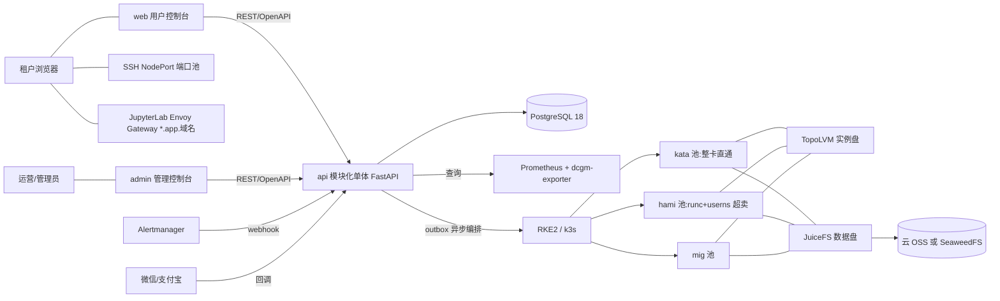

# SuperDL 架构参考

技术栈、模块边界、数据模型、核心流程与硬约束。
各模块的接口契约见 [`reference/`](./reference/),UI/UX 规格见 [`ui-ux-spec.md`](./ui-ux-spec.md),文档地图与维护约定见 [`README.md`](./README.md)。

## 1. 系统上下文



## 2. 技术栈

**后端**:Python 3.13(uv 管理)+ FastAPI + SQLAlchemy 2.0(async)+ asyncpg + Alembic + PostgreSQL 18;
定时与队列 APScheduler + 自研事务性 outbox;K8s 官方 `kubernetes` 客户端;支付 `wechatpayv3` + `alipay-sdk-python`;
观测 structlog + prometheus-client。

**前端**:React 19 + Vite + Ant Design 6 + TanStack Router / Query + Zustand + ECharts;i18n 用 i18next +
react-i18next(zh-CN / en-US);工程链 pnpm + Turborepo。antd 6 原生组件自封装,不引
`@ant-design/pro-components`;管理端监控图一律自绘(ECharts),Grafana 只作可选外链。

**平台层**:两档集群。**full** = RKE2 多机生产;**light** = k3s 单机。两档组件集相同,差异只在 k3s 侧的
values 覆盖;发行版由平台探测,业务侧无需声明。

依赖版本的单一事实源:`apps/api/pyproject.toml`(后端)、`package.json`(前端)、
`deploy/cluster/helmfile.yaml.gotmpl`(chart)。

| 组件 | 角色 |
|---|---|
| RKE2 / k3s | 容器平台,发行版钉 v1.36(userns `hostUsers: false` 已 GA) |
| Cilium | 仅 full 档;light 档用 k3s 内置 flannel |
| GPU Operator | 两档同装(NFD/GFD/DCGM/MIG/VFIO);light 档关掉 toolkit,宿主 toolkit 由装机基线装、k3s 自行探测 |
| kata-deploy | 两档同装,dedicated 档运行时;只落 kata 池节点 |
| Kata | RuntimeClass `kata-qemu`,VFIO 整卡直通 |
| HAMi | 共享档 CUDA 层软切分与限额 |
| kube-prometheus-stack | Prometheus 本地留 15 天,长期数据进 PostgreSQL |
| JuiceFS CSI | 数据盘;后端云 OSS 或自建 SeaweedFS |
| TopoLVM | 实例盘本地 NVMe,销毁为 lvremove(未清零;擦盘需节点开 issue_discards) |
| Envoy Gateway | 北向唯一入口(Gateway API 实现,`GatewayClass superdl`):三个平台域 + 租户 Jupyter 泛域名 + 对外服务端点泛域名 |
| cert-manager + acme-dns | 平台三域与泛域名证书(DNS01 经 acme-dns 中转,集群内凭据只能改 `_acme-challenge` TXT);Gateway 的 `certificateRefs` 引 `deploy/app/k8s/05-cert-manager.yaml` 里显式声明的 Certificate |

GPU 资源申请的 device-plugin 语法集中在 `app/core/gpu_adapter`;切 DRA 还需改 PodSpec 的 resourceClaims(`core/k8s/real.py`)。

## 3. 模块化单体

```
apps/api/app/
├─ core/            # 配置、DB、JWT、审计、错误体、金额、时间、outbox、限流、策略与平台配置
│  ├─ gpu_adapter/  # GPU 资源申请抽象层
│  └─ k8s/          # base(接口)/ real(kubernetes 客户端)/ fake(dev 与测试)
├─ modules/
│  ├─ account/      # 注册登录、JWT、SSH 公钥、实名字段
│  ├─ catalog/      # SKU、镜像目录、库存近似查询、镜像预热
│  ├─ orchestrator/ # 实例状态机、K8s 编排、reconciler、SSH 端口池、数据盘、服务端点
│  ├─ billing/      # 钱包、账本、小时结算、数据盘日结、余额巡检、支付渠道与回调、资金核对
│  ├─ metering/     # Prometheus 代理查询、usage_hourly 聚合
│  ├─ nodes/        # 节点注册(node-join.sh)、规格巡检、集群状态
│  ├─ notify/       # 短信 / 站内信 / 公告 / Alertmanager webhook
│  ├─ legal/        # 法务文档版本流与注册同意存证
│  ├─ tickets/      # 工单对话流与滞留巡检
│  └─ adminapi/     # 管理端 API,独立 JWT audience 与审计动作前缀
└─ workers/         # 同一镜像的第二入口:outbox worker + APScheduler 定时任务
```

模块之间只许 import 对方的 `service.py` 与 `schemas.py`,禁止跨模块 import 其他文件或跨模块查表;
唯一例外是 `account/deps.py`(全站鉴权依赖)。import-linter 以通配契约强制
(`app.modules.** -> app.modules.*.service|schemas`)。

对外契约 OpenAPI-first:FastAPI schema 导出 `openapi.json`,orval 生成 `packages/api-client`。用户 API
`/api/v1/*` 与管理 API `/api/admin/v1/*` 物理分离,独立 JWT audience、限流与审计动作前缀。

## 4. outbox 与 reconciler

**事务性 outbox。** 所有「改 DB + 动 K8s」的操作,在同一事务里完成业务写入与 `outbox_tasks` 插入,worker
用 `SELECT ... FOR UPDATE SKIP LOCKED` 领取后异步调 K8s(带重试、退避、死信)。领取条件是
`next_retry_at` 到期,`core/outbox.py` 的 `enqueue(delay_seconds=...)` 把它写到未来即得延迟任务。

**reconciler 对账循环。** 每 30s 比对「DB 期望状态 ↔ K8s 实际状态」(按租户 namespace 前缀 list):Pod 消失
而 DB 是 running → 记 `failed` 事件、停止计费并告警;Pod 存在而 DB 已 released → 强制删除并告警;
`creating` 超时未调度 → 失败退款。reconciler 不得关闭。

worker 侧其余定时任务:outbox 卡单回收、小时结算、数据盘日结、资金核对、usage 聚合、余额巡检、包周期到期巡检、
支付查单与超时关单、镜像预热巡检、节点规格巡检与入网 reconciler、工单滞留巡检、数据保洁。
定时任务一律先抢 pg advisory lock,多副本下单实例执行;周期与触发时刻见 `apps/api/app/workers/main.py`。

## 5. 接入层

| 通道 | 机制 |
|---|---|
| SSH | 控制面维护端口池表 `port_allocations`,每实例分配一个 NodePort;仅密钥登录,禁密码。**SSH 与 Jupyter 必须拆成两个 Service**:合并后 `type=NodePort` 会给每个 port 都分配 NodePort,Jupyter 会占走端口池号段 |
| JupyterLab | 实例 Pod 内跑 JupyterLab(8888),**每实例一条 HTTPRoute**(建在租户 ns,挂 `app-https` listener)按 host 路由到 ClusterIP Service,token 由控制面注入,泛域名证书一张 |
| 对外服务端点 | 服务型实例(`workload_type='service'`)的公网入口 `<slug>.svc.<域名>`,**每实例一条 HTTPRoute** 挂 `svc-https` listener。API Key 在网关校验(一条 `SecurityPolicy.extAuth` 挂 listener 服务全部端点,对象数 O(1)),用户容器不实现鉴权;**鉴权结果无缓存**,控制面是全部端点的同步依赖,见 [reference/services.md](./reference/services.md) |
| 租户 NetworkPolicy | 默认拒东西向。入方向只放行两处:Envoy 数据面所在 ns(`envoy-gateway-system`,不是 Gateway 对象所在的 `superdl`)**不限端口**(服务容器端口由用户声明),以及 TCP 22(SSH NodePort,来源不能排整段私网 —— 跨节点 NodePort 经 SNAT 后是节点内网 IP;但**必须排掉 Pod 网段**,不排则租户可互扫 22)。出方向 DNS 收敛到 CoreDNS,公网 TCP 扣滥用端口与数据存储端口黑名单、UDP 走白名单,私网与云元数据网段一律拒 |
| 网关策略 | 源 IP 白名单(管理端)、边缘限流(API 域,匿名回调路由同款重写 + 更严请求体上限)、服务端点鉴权与限流、租户 Jupyter listener 限流、全局超时与连接兜底,7 个策略对象挂在 Gateway / HTTPRoute 上(`deploy/app/k8s/04-gateway.yaml`)。挂载点是 listener 的 `sectionName`,**写错不报错**:apply 照样成功,策略静默失效,唯一线索在策略对象的 `status.ancestors[].conditions`;6 个 listener 名锁死 |

控制面 ServiceAccount 按 worker 组件拆分;租户资源的写权限是 ClusterRole,实际可达面由
`deploy/cluster/admission/tenant-restrictions.yaml` 的**七条 ValidatingAdmissionPolicy(全部 `Deny`)**收窄:
平台 SA 写范围(`superdl` / `tenant-*` namespace 与 nodes)、租户 Pod 安全基线、Node 字段级写白名单、
全局 Pod 兜底、Pod 与 Job 模板各一条 Secret 引用白名单、Node 删除对象白名单,RBAC 与准入叠加才是完整最小权限。
后两条 Secret 白名单堵的是「命名空间内 `pods:create`(或 `batch/jobs:create`)等价于该命名空间的
`secrets:get`」这条 RBAC 直觉之外的通路,机制与完整口径见
[`reference/security.md`](./reference/security.md)。HTTPRoute 条数随活跃实例线性增长,是 Envoy 数据面内存的主要变量。

## 6. 数据模型

`users` 一对多持有 `instances` / `data_disks` / `orders`,一对一持有 `wallets`;`skus` 定义实例规格;`instances` 派生
`instance_events`(状态流水)、`bills_hourly`(账单)、`usage_hourly`(指标聚合),并可挂载一块 `data_disks`(按日出 `bills_daily_disk`)。

| 模块 | 表 |
|---|---|
| account | `users` `ssh_keys` `used_refresh_tokens` `sms_codes` `user_quota_overrides` `account_deletion_requests` |
| catalog | `skus` `images` `image_node_cache` |
| orchestrator | `instances` `instance_events` `port_allocations` `data_disks` `service_endpoints` `service_api_keys` |
| billing | `wallets` `balance_ledger` `bills_hourly` `bills_daily_disk` `subscriptions` `settlement_watermarks` `settlement_gaps` `reconcile_checkpoints` `orders` `invoice_requests` `refund_requests` |
| metering | `usage_hourly` |
| nodes | `node_enrollments` `node_specs` `cluster_status` |
| notify | `notifications` `announcements` |
| legal | `legal_doc_versions` `user_consents` |
| tickets | `tickets` `ticket_messages` |
| adminapi | `admin_users` `admin_adjustments` |
| core | `outbox_tasks` `audit_log` `policy_overrides` `platform_settings` `rate_limit_counters` |

- 金额列一律 `numeric`:单价 `numeric(12,4)`,入账 `numeric(14,2)`。
- 结算幂等键:`bills_hourly` UNIQUE(instance_id, hour_start)、`bills_daily_disk` UNIQUE(disk_id, day)、`usage_hourly` UNIQUE(instance_id, hour_start)。
- 支付与创建幂等:`orders.channel_txn_id` / `order_no` 唯一;`orders`、`instances`、`data_disks` 均带
  UNIQUE(user_id, idempotency_key)。
- `instance_events`、`balance_ledger` 追加式不可改,后者带 `balance_after` 快照;`balance_ledger.ref_type` 有 CHECK 白名单(含 `subscription`)。
- **`instances.market`(on_demand / subscription / spot,CHECK 兜底)是「怎么买」,`skus.tier` 是「买什么档」,两者正交** ——
  一条 SKU 同时供多种购买模式售卖,不为包周期另建 SKU 行。包周期的预付凭证落 `subscriptions`:续费**新开一行**
  并用 `renewed_from_id` 串链、老行转 expired,不在原行上累加到期时刻。
- 订阅行的 UNIQUE(user_id, idempotency_key) 服务**转换与续费**两条路径,共用一个键命名空间,故两处重放查询都带 `subscriptions.request_fingerprint` 做异参检测(同键异参 409);下单那条订阅行不带幂等键,整笔创建的幂等由同事务的 `instances` 行担保。
- 服务端点凭据只存密钥摘要:`service_api_keys.key_hash` 唯一(HMAC-SHA256),明文只在创建响应出现一次,
  吊销写 `revoked_at` 不删行;`service_endpoints.public_slug` 唯一,是公网域名左标签(不用 instance.uuid)。
- `skus.oversell_cores` 变更仅影响新实例;`data_disks.price_gb_month` 是创建时快照价,调价不追溯已有盘。

## 7. 核心流程

### 7.1 实例状态机

| 状态 | 允许迁移到 |
|---|---|
| creating | running(Pod Ready,计费开始)/ failed(调度或拉镜像超时,全额退)/ releasing(用户取消) |
| running | stopping(关机 / 欠费 / 到期 / 竞价被回收)/ failed(pod_lost,仅系统) |
| stopping | stopped(Pod 删除,出尾账)/ releasing(悬挂超时或用户直接放弃) |
| stopped | starting(校验余额)/ frozen(欠费)/ releasing(用户释放,二次确认) |
| starting | running / failed(库存不足) |
| frozen | stopped(充值解冻)/ releasing(宽限到期) |
| failed | stopped(恢复重开,复用实例盘)/ releasing(清理失败实例) |
| releasing | released(实例盘 LV 已删除,lvremove 未清零) |

`released` 是唯一终态。状态迁移只能经 `orchestrator/service.py` 的 transition 函数,同事务写 `instance_events`,禁止直接
UPDATE status。`stopped` 保留实例盘(节点本地 LV,重开机 pin 回原节点),数据盘照常计费。

### 7.2 创建实例

`POST /api/v1/instances`(带 `Idempotency-Key`)在一个事务里校验余额覆盖 `afford_cover_hours`(默认 1)小时的预估费用,
写 `instances(creating)` + `instance_events` + `outbox_tasks`,立即返回 202。worker 领取后 ensure Namespace /
NetworkPolicy / Quota / JuiceFS PVC,再建 Pod(RuntimeClass 与 GPU 资源语法按**节点池**经 gpu_adapter 派发,注入公钥与
jupyter token)、SSH 与 Jupyter 两个 Service、HTTPRoute;Pod Ready 后同事务转 `running` 并写计费起点事件,超时未 Ready
转 `failed` 并退款清理。包周期下单在同一事务里多做两件事:按周期总价一次性预扣 + 落一行 `subscriptions`(§7.5)。

### 7.3 小时结算

**计费的事实源是 `instance_events`**(running ↔ 非 running 的边);Prometheus 指标只做展示与对账,不参与计费。

每小时 :02 触发(advisory lock 单实例执行),结算窗口由 `settlement_watermarks` 水位线推进,漏掉的窗口下一轮自动补上
(追平有上限,超出需人工补,`SETTLEMENT_LAG` 指标持续告警)。每个窗口扫 `instance_events` 重建 running 秒数 → 幂等
upsert `bills_hourly` → 同事务 `wallets` `FOR UPDATE` 扣减并写 `balance_ledger`。离开 running 时由计费边监听器即时出尾账,
与状态迁移同事务。数据盘日结与资金核对按**北京日界**跑(北京 00:10 / 00:30,即 UTC 16:10 / 16:30,见
`core/timeutil.billing_day_floor`);资金核对只报不改。usage 聚合独立运行:Prometheus 全挂,计费不停。
口径与参数见 [`reference/billing.md`](./reference/billing.md)。

### 7.4 欠费与回收

余额巡检每 5 分钟一轮:预估可用时长低于预警阈值 → 短信与站内预警;余额耗尽 → 停机出尾账 → `frozen` 并倒计时 →
到期 `releasing` → 删除 K8s 资源 → 实例盘 lvremove → `released`。数据盘走独立时钟:欠费宽限(只读)→ 冻结 → 清除。
天数与盘价都是可在线调整的策略参数(`policy_overrides`),取值见 [`reference/billing.md`](./reference/billing.md)
与 [`reference/disks.md`](./reference/disks.md)。

### 7.5 包周期(预付订阅)

`market='subscription'` 的实例下单时一次性预扣整段周期的费用,不走小时结算。周期取**定长小时**
(日 24 / 周 168 / 月 720 / 年 8760),定价与到期时刻同源;折扣按周期长度分四档,是可在线调整的策略参数。
下单、续费与到期链路都在 `app/modules/billing/subscriptions.py`,折扣与报价的唯一计算点在 `app/core/pricing.py`。

进入包周期有两条路:创建时直接买,或把在跑的按量实例就地转过来(`POST /api/v1/instances/{uuid}/subscribe`)。
转换在同一事务里**先结清转换前那段按量账、再翻 `market`**(结算候选按实例当前的 market 挑,顺序不可颠倒)。

到期链路由 `subscription_patrol`(30 分钟一轮)驱动:临期预警 → 到期且开了自动续费则扣款续期 → 否则停机 →
冻结并写 `frozen_deadline`;回收那一步仍由余额巡检的 frozen 分支做,状态机与回收逻辑只有一处实现。
预付语义的三条后果(中途释放不退款、到期不自动转按量、余额为零不停机)与四处配套过滤见
[`reference/billing.md`](./reference/billing.md)。

### 7.6 竞价(抢占与回收)

`market='spot'` 的实例拿折后价(按量价 × `spot_discount_pct`,默认 4 折),对价是**容量紧张时可被平台回收**。
折扣只落在 `instances.price_hourly` 上,其余一切与按量实例相同:进小时结算、出尾账、走同一条欠费链 ——
计费引擎不感知竞价。

按量或包周期用户建实例而软准入判定容量不足时,`orchestrator/preempt.py` 挑竞价实例回收(候选规则见 §8.7),
凑不够则请求方照旧拿 409。宽限窗不用新机制:状态机立刻迁 `stopping`(用户当即看到并收到短信与站内信),
删 Pod 的 outbox 任务延迟 `spot_grace_seconds` 才到期,窗内 Pod 还在、SSH 还能登。终态是 `stopped` 而非
`frozen`(它没欠费),实例盘保留,有容量时用户可自行开机。

用户可随时 `POST /api/v1/instances/{uuid}/to-on-demand` 转按量免除回收风险,不动 Pod、零中断,代价是
**当前整点小时整体改按按量价结算**(`bills_hourly` 一小时只有一个单价)。口径见
[`reference/orchestrator.md`](./reference/orchestrator.md) 与 [`reference/billing.md`](./reference/billing.md)。

## 8. 硬约束

1. **Kata 与 HAMi 不能共用同一批 GPU,必须分池**(HAMi device plugin 与 Kata / KubeVirt 不兼容)。节点池标签
   `superdl.io/pool` 装机时定死。**隔离机制的派发键是池,不是档位**:`core/gpu_adapter` 按 kata / mig / hami / cpu
   决定 RuntimeClass、资源语法、userns 与调度器;`skus.tier`(dedicated / shared / cpu)只是售卖分类,两者的合法
   配对由 `TIER_POOLS` 与 catalog 的 `_check_tier_pool` 收口。
2. **`gpu_count == 0`(纯 CPU 实例)的判定先于池分支。** cpu 档允许挂 hami 池吃 GPU 机的空闲 CPU,按池分支走
   会替一台不用卡的实例申请 `nvidia.com/gpu`。计费份数同理收口到 `core/money.billing_units`(GPU 实例 = 卡数,
   CPU 实例 = 1 份整机),不散写 `单价 × gpu_count`。
3. **超卖只发生在 HAMi 池。** kata 与 mig 池不超卖;cpu 档不涉及显卡超卖。`oversell_cores` 是纯定价参数,
   不下发调度(schema 上界 9.99)。HAMi 池的隔离是软件限额(LD_PRELOAD CUDA 拦截),不是安全边界;
   容器内 root 可绕过配额,且多租户共用同一未分区 GPU 存在显存残留面。详见 `reference/security.md` 隔离级别分级。
4. **hami / mig / cpu 池的 Pod 必须 `hostUsers: false`(userns)**,容器内 root 映射为宿主非特权 UID;kata 池本身是
   VM 级隔离,不加 userns。
5. **数据盘独立于实例生命周期**:释放实例不删数据盘,关机也照常计费。
6. **包周期实例只在 `orchestrator/queries.py::billing_candidates` 一处跳过小时结算。** `upsert_hour_bill`、水位线、
   缺口机制一行不动;跳过点禁止散开。
7. **竞价抢占只在同池同型号内选,按 `created_at` 从新到旧,凑不够一台都不动。** 这三条逐字写进知情同意给用户看,
   改排序或候选谓词等同于改用户可见文案,两边同提交。抢占与请求方的建实例**同事务**,请求方失败即整体回滚;
   被抢占实例按实际运行秒数正常结算,不免单。

金额与时间口径、钱包加锁、模块边界等编码级硬性规范与闸门见 `CLAUDE.md`。
