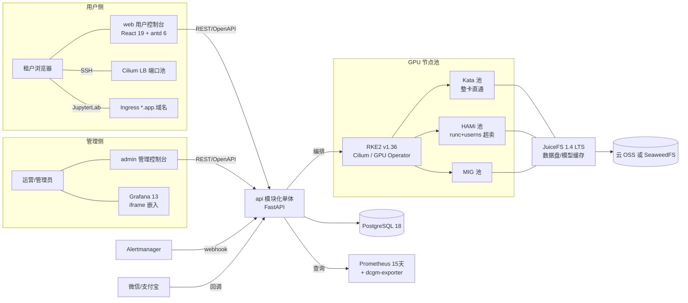
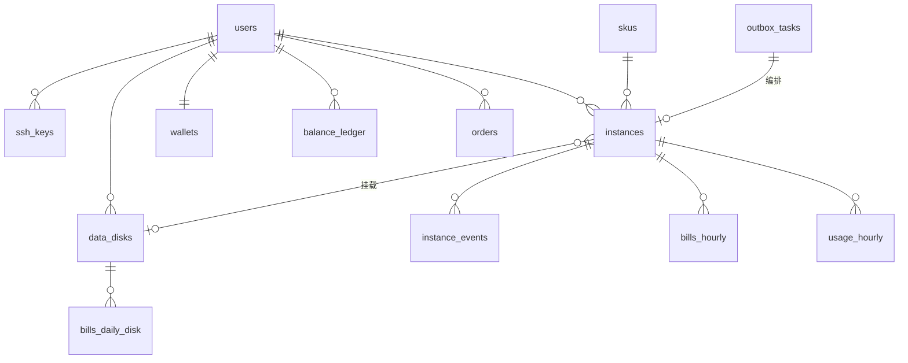
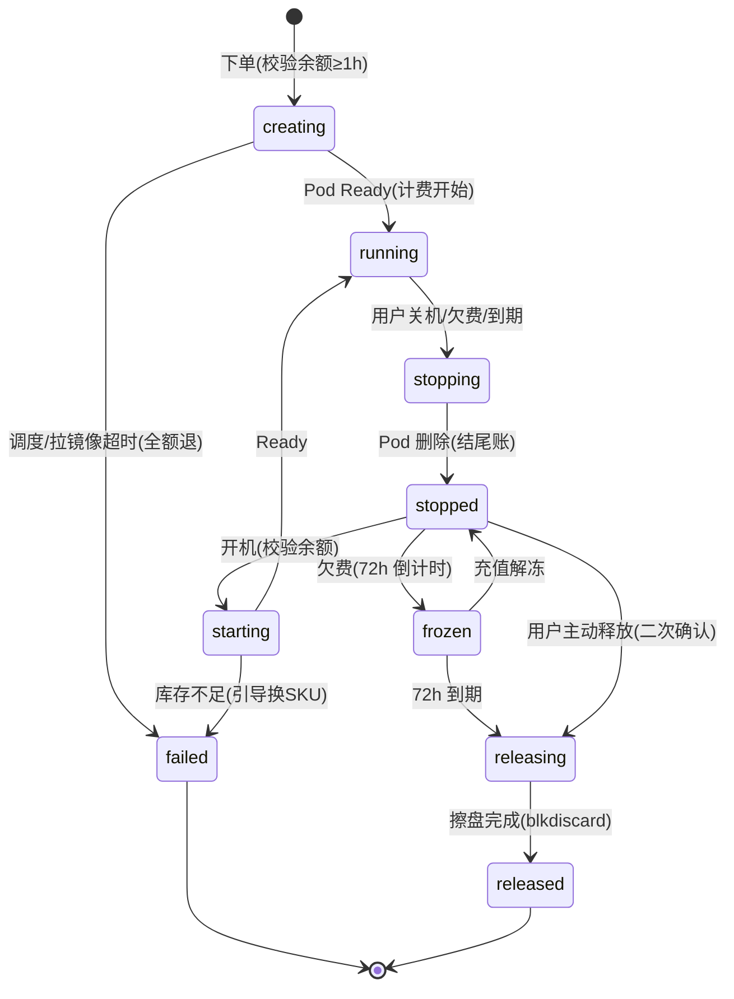
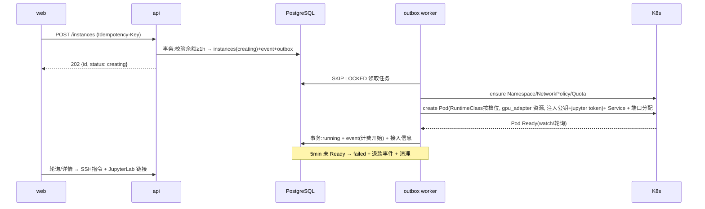

# SuperDL · GPU 算力租赁平台开发方案

> 基于《核心 MVP 方案(精简版)》撰写。所有第三方组件版本号均于 **2026-08-19** 经 GitHub Releases / 官方文档核实。
> 配套文档:[`ui-ux-spec.md`](./ui-ux-spec.md)(两端 UI/UX 规格)。

---

## 0. 摘要(一页读懂)

| 维度 | 结论 |
|---|---|
| 总体判断 | 原 MVP 方案的取舍(七件套 + 薄单体 + 事件计费为主)**方向正确,予以保留**;本方案给出 3 处必须修正、若干补充,并落到可执行的工程与排期设计 |
| 后端 | Python 3.13 + uv + **FastAPI** + SQLAlchemy 2.0(async) + PostgreSQL 18;模块化单体;**事务性 outbox + reconciler** 是控制面正确性的两根支柱 |
| 前端 | React 19 + Vite 8 + **Ant Design 6** + TanStack Router/Query + ECharts;`web`(用户控制台,参照 AutoDL)与 `admin`(管理端,自设计)双应用 monorepo |
| API | OpenAPI-first,后端 schema 即契约,**orval** 生成前端 TanStack Query hooks,前后端由 AI 并行开发不错位 |
| 必须修正 | ① Kata 与 HAMi 互斥 → 分池铁律;② MinIO 社区版已停维 → JuiceFS 后端改云 OSS / SeaweedFS;③ 范围补 JupyterLab 入口(体验对齐 AutoDL 的最大单项) |
| 开发方式 | **全部由 AI 编码代理开发**:spec 先行、强测试闸门、13 个工作包(WP0~WP12)串并行推进;实机集群 / 支付资质 / 备案等 9 项人工事项单列 |
| 交付节奏 | 对齐原 W1~W5:W1~W2 平台底座(人工执行 + AI 产出全部脚本),W2~W4 后端工作包,W4~W5 前端 + 端到端演练 |

---

## 1. 对原 MVP 方案的意见

### 1.1 赞同并保留的设计(点名,避免后续被"优化"掉)

1. **以实例状态机事件流水为计费主依据,Prometheus 指标仅作展示与对账** —— 这是整个方案里最重要的一条正确决策,计费从此不依赖监控系统的可用性。本方案将其落实为 `instance_events` + `bills_hourly` 双表设计(见 §4)。
2. Prometheus 本地只留 15 天、长期数据进 PostgreSQL —— 避开 Thanos 的关键,保留。
3. 审计 = 业务两张表 + K8s audit policy 开关 —— 保留,`audit_log` 用 API 中间件统一插入。
4. 超卖分维度(算力大胆、显存谨慎 ≤1.2)、超卖只发生在 HAMi 池、binpack 调度、按档位分节点池 —— 全部保留,并在管理端把「实际超卖率 vs 真实利用率」做成一等公民仪表盘(见 ui-ux-spec §管理端)。
5. 数据盘独立于实例生命周期、作为留存抓手 —— 保留,且在用户端 UI 上做成统一「存储」页(这恰是 AutoDL 信息架构最大的债务,我们的差异化机会,见 §1.3-5)。

### 1.2 必须修正的三处

#### 修正一(🔴 架构级):Kata 与 HAMi 在同一批 GPU 上互斥,分池必须升格为硬约束

HAMi 的实现方式是把宿主 GPU 直接挂进容器,并用 hostPath 注入 `libvgpu.so` + `/etc/ld.so.preload` 劫持 CUDA 调用做限额;**HAMi 官方 FAQ 明确其 device plugin 与 Kata Containers / KubeVirt 不兼容**;NVIDIA GPU Operator 文档同样明确 vGPU 类切分不支持 Kata。原方案"整卡档 Kata、共享档 HAMi"的分池方向是对的,但必须写成不可违反的硬约束:

| 档位 | 运行时 | GPU 交付方式 | 加固 |
|---|---|---|---|
| 独享整卡 | **Kata 4.0**(RuntimeClass=kata-qemu) | VFIO 直通 | VM 级隔离 |
| MIG 切分 | runc(或 Kata,W2 实测定) | MIG 实例经 device plugin | 硬件隔离 |
| 共享标准/经济 | **runc + HAMi** | libvgpu 软切分 | `hostUsers: false`(userns)+ seccomp + drop caps + no-new-privileges |

两点补充:

- **Kata 按 4.0 规划**:Kata 4.0(2026-07)已把 Rust `runtime-rs` 设为默认,Go runtime 弃用并将在 5.0 移除。不要在 3.x 上建设。
- **共享池用 K8s 1.36 的 user namespaces 补隔离**:`hostUsers: false` 已在 K8s 1.36 GA(要求内核 ≥6.3,Ubuntu 26.04 满足;注意 1.36 已移除 containerd 1.x 支持)。容器内 root 映射为宿主非特权 UID,HAMi 池"共享内核"的剩余风险显著下降,而这正是共享档的最大安全短板。**因此 RKE2 选 v1.36(latest 通道)而非 stable(1.35)**;若 W1 兼容验证不过,退 1.35 并以 beta 特性开启 userns。

#### 修正二(🔴 W1 必须实测):多卡节点上 Kata 整卡直通的分配粒度

NVIDIA 文档提示 Kata/VFIO 直通场景下 GPU 分配可能受 IOMMU 分组约束(极端情况:一节点的卡必须整体给同一台 Kata VM)。这直接决定"独享整卡档"能否在 8 卡机上按单卡出租。**W1 的 Kata 实测必须包含:8 卡节点上同时开 2 个单卡 Kata 实例、互相无感知、性能损耗 < 5%**。若实测受限,预案:整卡档在多卡节点改售「整机档」,或降级为 runc + userns 强化档(定价与条款相应调整)。

#### 修正三(🔴 选型级):MinIO 社区版已死,JuiceFS 后端必须换

时间线:MinIO 2025 年中从社区版剥离管理控制台引发反弹 → 2026-02 声明不再维护 → **2026-04-25 仓库归档(只读)**。原方案"MinIO 集群内 4 节点纠删码"不可再选。替代顺序:

1. **首选云对象存储(OSS/COS/OBS)**:连自建集群都省掉,JuiceFS 天然适配"数据在对象存储、热数据本地缓存";
2. 必须自建时选 **SeaweedFS 4.4x**(Apache-2.0,34k★,日更,生产验证充分);小规模求省心可评估 Garage。

JuiceFS 本身健康无虞:**锁 1.4.x LTS**(Apache-2.0,24 个月维护期),元数据 Redis 三节点哨兵方案不变。

### 1.3 建议补充的设计(按优先级)

1. **JupyterLab 网页入口纳入 MVP**(已确认)。AutoDL 用户的肌肉记忆是"开机 → 点 JupyterLab",只给 SSH 会显著抬高种子用户上手门槛。实现:泛域名 `*.app.<域名>` + Ingress(Cilium Gateway API)按 host 路由到实例 Service,token 由控制面生成注入,泛域名证书一张。约 2~3 天工作量(WP7)。
2. **计费护栏三件套**:①开机前校验"余额 ≥ 1 小时预估费用";②余额低于阈值短信/站内预警(阈值用户可设,AutoDL 同款);③余额耗尽 → 自动关机 → 冻结 72h → 回收,每步落事件与通知。杜绝负余额裸奔。
3. **库存竞态处理**:"库存 = 实时查 K8s"在并发下单时会超卖。方案:市场页只展示近似库存(30s 缓存);创建时不做预占,**以 K8s 调度结果为准**——Pod 5 分钟内未调度成功即自动失败退款,前端引导换档位(对应 AutoDL"空闲 GPU 不足"的体验)。MVP 不做分布式预占锁,复杂度不值得。
4. **GPU 故障 SOP 进 MVP 运维手册**:DCGM XID 致命错误告警(原方案已有)→ 自动 cordon 节点 → 通知受影响租户 → 该卡实例按停机处理并补偿代金券(额度=当日消费,上限可配)。故障是必然事件,SOP 和补偿规则必须上线前定好。
5. **统一存储页(差异化)**:AutoDL 有系统盘/数据盘/文件存储/高速文件存储/网盘/公开数据六层三种计费口径,是其信息架构最大债务。我们只有三层——实例盘(随实例)、数据盘(独立计费)、公共模型缓存(只读免费)——用一张「挂载全景图」讲清楚,是明确的体验优势,商品页可直接当卖点讲。
6. **防挖矿与合规条款**:用户协议明示禁止挖矿(AutoDL 市场页有"严禁挖矿,一经发现立即封号"合规条,属行业标配);检测手段(DCGM 功耗/利用率模式识别)后置。
7. **发票与企业认证字段预留**:MVP 不做开票流程,但 `orders`/`users` 表预留 `invoice_*`/`company_*` 字段,避免日后迁移。

### 1.4 合规提醒(需人工启动,均有 lead time,建议本周就动)

| 事项 | 说明 | 周期 |
|---|---|---|
| ICP 备案 | 域名 + 服务器备案,上线硬前提 | 2~4 周 |
| 增值电信资质咨询 | 算力租赁可能涉及 IDC/ISP 类增值电信业务许可,**务必咨询属地通管局或律师**,不同地区口径不一 | 数周~数月 |
| 支付资质 | 微信支付商户号 + 支付宝商户,需营业执照,审核约 1 周;之后才能真实联调 | 1~2 周 |
| 实名认证 | 平台向用户提供网络接入,按《网络安全法》需实名;接入三要素核验 SDK(MVP 可后置到充值前强制) | 1 周 |
| 短信签名/模板 | 验证码与预警短信需报备签名 | 1 周 |
| 等保 | 二级定级备案建议在试运营期启动 | 1~3 月 |

---

## 2. 总体架构

### 2.1 系统上下文



### 2.2 单体内部模块(modular monolith)

```
apps/api/app/
├─ core/            # 配置、DB、安全(JWT)、审计中间件、outbox 框架、K8s 客户端封装
│  └─ gpu_adapter/  # GPU 资源申请抽象层:device-plugin 语法今天用,DRA 语法未来切(12~18 月观察项)
├─ modules/
│  ├─ account/      # 注册登录、SSH 公钥、实名/企业字段
│  ├─ catalog/      # SKU、平台镜像目录、库存近似查询
│  ├─ orchestrator/ # 实例状态机、K8s 编排、reconciler、端口池、JupyterLab token
│  ├─ billing/      # 钱包、账本、小时结算、数据盘日结、冻结回收、支付渠道
│  ├─ metering/     # Prometheus 代理查询、usage_hourly 聚合、对账
│  ├─ notify/       # 短信/站内信/Alertmanager webhook 接入
│  └─ adminapi/     # 管理端专用 API(独立鉴权、独立审计)
└─ workers/         # 同一镜像的第二入口:outbox worker + APScheduler 定时任务
```

**为什么不拆微服务**:团队为 AI 代理 + 极小人工验收带宽,分布式事务与部署面会把验收成本放大数倍。模块间只许经 service 层调用、禁止跨模块查表(CI 用 import-linter 强制),未来要拆时按模块切割即可。

### 2.3 控制面正确性的两根支柱

**支柱一:事务性 outbox。** 所有"改 DB + 动 K8s"的操作,一律在同一个 PostgreSQL 事务里完成「业务写入 + `outbox_tasks` 插入」,由 worker 异步执行 K8s 调用:

```
BEGIN;
  INSERT INTO instances(status='creating', ...);
  INSERT INTO instance_events(to_status='creating', ...);
  INSERT INTO outbox_tasks(type='create_instance', payload={...});
COMMIT;
-- worker: SELECT ... FOR UPDATE SKIP LOCKED → 调 K8s → 更新状态(带重试/退避/死信)
```

保证"扣了费但没建资源""建了资源但没记账"这类不一致在架构上不可能发生。不引入 Temporal/Celery——单体 + 单 Postgres 场景,自研 outbox(约 200 行)+ APScheduler 3.11(4.0 常年 alpha,不碰)+ `pg advisory lock`(多副本防重)是 2025~2026 社区对这个规模的共识做法。

**支柱二:reconciler 对账循环。** 每 30s 全量比对「DB 期望状态 ↔ K8s 实际状态」(按租户 namespace 前缀 list):Pod 消失而 DB 是 running → 记 `failed` 事件停止计费并告警;Pod 存在而 DB 已 released → 强制删除并告警(泄漏 = 白送算力);`creating` 超 5 分钟未调度 → 失败退款。**自研控制逻辑最容易翻车的点就在这里,reconciler 是兜底的地板。** Python 官方 K8s 客户端(36.x,已对齐 K8s 1.36)没有 client-go 的 informer 生态,轮询 + watch 兜底的模式在千级实例前完全够用;超过再考虑重写为 Go operator(模块边界已为此预留)。

### 2.4 接入层

| 通道 | MVP 方案 | 演进 |
|---|---|---|
| SSH | 控制面维护**端口池表**(`port_allocations`),每实例分配一个 LB 端口(Cilium LoadBalancer/NodePort),展示 `ssh root@ssh1.<域名> -p 3xxxx`;**仅密钥登录,禁密码** | P1 换 sshpiper v1.6(维护活跃,自带 K8s 插件):单一 22 端口按用户名路由,免端口管理 |
| JupyterLab | 实例 Pod 内跑 JupyterLab,`<instance-id>.app.<域名>` 泛域名 Ingress 按 host 路由,token 控制面注入,泛域名证书 | P1 同通道加 TensorBoard/自定义服务端口 |
| 安全边界 | 租户 Pod:默认拒东西向 NetworkPolicy;禁访节点网段/Service 网段/云元数据;放行出公网。控制面 ServiceAccount 仅限 `tenant-*` namespace 前缀 | 不变 |

---

## 3. 技术选型(2026-08-19 核实版)

### 3.1 后端

| 组件 | 版本 | 理由 |
|---|---|---|
| Python / uv | 3.13 / 0.12 | uv 已是包管理事实标准;3.13 生态兼容最稳 |
| FastAPI | 0.141.x | OpenAPI 3.1 自动生成 = 前端代码生成的契约源头 |
| SQLAlchemy + asyncpg | **2.0.52**(async)+ Alembic | 2.1 尚在 beta,不追;迁移用 Alembic,CI 里 `alembic check` 防漂移 |
| PostgreSQL | 18 | 19 未 GA;金额一律 `numeric`,时间一律 `timestamptz` |
| 定时/队列 | APScheduler 3.11 + 自研 outbox | 见 §2.3;Celery/Temporal 对此规模是负资产 |
| K8s 客户端 | `kubernetes` 36.x | 官方库,版本已对齐 K8s 1.36 |
| 支付 | `wechatpayv3` 2.0.x + `alipay-sdk-python` 3.7.x | 微信官方无 Python SDK,wechatpayv3 是社区事实标准(平台证书自动更新/验签齐全);支付宝为官方 SDK |
| 观测 | structlog + prometheus-client + OTel(可后置) | /metrics 由 kube-prometheus-stack 抓取 |
| 质量 | ruff + pyright + pytest(+pytest-asyncio, testcontainers) | AI 产码的第一道闸门 |

### 3.2 前端

| 组件 | 版本 | 理由 |
|---|---|---|
| React + Vite | 19.2 + 8.x | Vite 8(Rolldown)构建提速 10~30×;**不用 Next.js**——两个控制台均为登录后纯客户端应用,SSR 零收益纯负担 |
| Ant Design | **6.6**(2025-11 发布 v6,React 19 原生) | 重表格/表单/抽屉密度是复刻 AutoDL 式控制台的最短路径;⚠️ `@ant-design/pro-components` 稳定版仍锁 antd5,**两端一律用 antd 原生组件自封装,不引 pro 全家桶** |
| 路由/数据 | TanStack Router 1.x / Query 5.x + Zustand 5 | 2026 数据层共识;服务端状态全走 Query,客户端状态极薄 |
| 图表/终端 | ECharts 6.1(echarts-for-react)/ `@xterm/xterm` 6.0 | xterm 已改名 scope,旧包停维;Web 终端 P1 预留 |
| API client | **orval 8.x** | 2026 年最活跃的 OpenAPI 代码生成器,直出 TanStack Query hooks + zod;openapi-typescript 已半年未发版且周边宣布维护模式 |
| 工程链 | pnpm 11 + Turborepo 2.10 + ESLint/Prettier | Biome 采用度仅 ESLint 的 ~8%,商业项目不赌 |
| 管理端图表 | 自建 Grafana 13 iframe 嵌入(`allow_embedding=true` + 反代注入鉴权 header,只读 Viewer) | 官方文档化做法;运维曲线零自研,自研只做业务管理页 |

### 3.3 平台层(与原方案的差异已在 §1.2 说明)

| 组件 | 版本/通道 | 备注 |
|---|---|---|
| RKE2 | **v1.36**(latest 通道) | 为 userns GA;W1 验证不过退 1.35 |
| Cilium / GPU Operator | 1.20 / v26.3 | 按 Operator 兼容矩阵锁 |
| Kata | **4.0** | Rust runtime 默认 |
| HAMi | **v2.9**(CNCF Incubating,2026-07 晋级) | 动态 MIG 自 v2.5 可用;HAMi-DRA(v0.2)与 HAMi-WebUI(88★)均不依赖 |
| kube-prometheus-stack | 88.x | DCGM 大盘以社区 **24450** 为底改造(12239 已用废弃面板插件) |
| JuiceFS | **1.4.x LTS** | 后端云 OSS 首选;自建 SeaweedFS 4.4x |
| TopoLVM | chart 17.x | 实例盘本地 NVMe,销毁 `blkdiscard` |
| DRA 态度 | 观察,不采用 | DRA 已 GA(K8s 1.34)但只管调度承诺、不管运行时强制;HAMi 的 CUDA 层限额才是超卖计费可信度的根基。`gpu_adapter` 抽象层已为 12~18 个月后切换留口 |

---

## 4. 数据模型

### 4.1 ER 概览



### 4.2 表清单与关键设计

| 表 | 关键字段 / 约束 | 说明 |
|---|---|---|
| `users` | phone 唯一、status(active/frozen)、实名/企业字段预留 | 租户 = 用户,MVP 不做组织;`tenant_ns = "tenant-{id}"` |
| `ssh_keys` | public_key、fingerprint 唯一 | 注入实例 authorized_keys |
| `skus` | gpu_model、tier(dedicated/mig/shared_std/shared_eco)、mig_profile、gpucores/vram 限额、**oversell_cores、oversell_vram**、pool_label、price_hourly `numeric(12,4)`、status | 超卖参数是 SKU 属性,管理端可视化编辑;变更仅影响新实例 |
| `instances` | uuid、status、k8s 定位字段(namespace/pod/node)、ssh_port、jupyter_token、image_ref、data_disk_id、`version`(乐观锁) | 状态机见 §5.1 |
| `instance_events` | from/to_status、reason、actor(user/system/admin)、metadata | **计费主依据 + 用户可见时间线**,追加式不可改 |
| `wallets` | balance、frozen_amount,均 `numeric(14,4)` | 更新必须 `SELECT ... FOR UPDATE` + 同事务写 ledger |
| `balance_ledger` | type(recharge/consume/refund/adjust)、amount 带符号、balance_after、ref_type/ref_id | 追加式流水;对账基准 |
| `orders` | type、channel、channel_txn_id 唯一、**idempotency_key 唯一** | 充值/购盘订单;支付回调幂等靠 channel_txn_id |
| `bills_hourly` | **UNIQUE(instance_id, hour_start)**、seconds_used、unit_price、amount | 小时账单,结算幂等键;关机时段补一条不足整点的尾账 |
| `bills_daily_disk` | UNIQUE(disk_id, day) | 数据盘按日扣(GB·月单价/30),关机也扣——UI 上归入「日常费用」栏(AutoDL 同概念) |
| `usage_hourly` | UNIQUE(instance_id, hour_start)、gpu_util_avg、vram_max 等 | Prometheus 聚合,仅展示与对账,**不参与计费** |
| `data_disks` | size_gb、juicefs_subpath、expires_at、status | 到期 7 天宽限 → 冻结 → 30 天后清除(策略参数化) |
| `outbox_tasks` | type、payload jsonb、status、retries、next_retry_at、locked_by | SKIP LOCKED 领取;5 次退避后进 dead 并告警 |
| `port_allocations` | port 唯一、instance_id nullable | SSH 端口池 |
| `audit_log` | actor_type/id、action、target、ip、result、detail | API 中间件统一插入;管理端操作单独 action 前缀 |
| `admin_users` | role(admin/ops/finance/readonly) | 与租户体系完全隔离,独立登录与 JWT audience |
| `sms_codes` / `notifications` | — | 验证码限频;预警/公告站内信 |

**金额铁律**:全链路 `numeric`,禁止 float;单价 4 位小数、账单 2 位小数入账,舍入规则(半角向偶)写进 spec 与单测。

---

## 5. 核心流程

### 5.1 实例状态机



- 每次迁移写 `instance_events`(同事务),**running↔非 running 的边就是计费边**。
- `stopped` 状态保留实例盘(节点本地 LV,重开机 pin 回原节点);数据盘照常计费。
- 冻结/回收倒计时在用户端一等公民展示(AutoDL 把释放规则藏得深,是可超越点)。

### 5.2 创建实例(时序)



### 5.3 小时结算(事件驱动,幂等)

每小时 :02 触发(advisory lock 单实例执行):对上一自然小时,扫 `instance_events` 重建每个实例的 running 秒数 → `INSERT ... ON CONFLICT DO NOTHING` 入 `bills_hourly` → 对新插入行,同事务 `wallets FOR UPDATE` 扣减 + `balance_ledger`。关机/释放时另走**即时尾账**(当小时已用秒数)。数据盘每日 24:00 同模式日结。usage_hourly 聚合独立运行,只为展示与对账——**Prometheus 全挂,计费不停**。

### 5.4 欠费与回收

余额巡检(5 分钟):预估余额可用时长 < 24h → 预警(短信+站内,AutoDL 行内徽标同款);余额 ≤ 0 → 停机(尾账)→ `frozen`(72h);到期 → `releasing` → 删除 K8s 资源 → LV `blkdiscard` → `released`。数据盘独立宽限,不随实例回收——"数据在你这,客户就会回来"。

---

## 6. API 设计

### 6.1 原则

- **OpenAPI-first**:FastAPI schema 即契约,CI 导出 `openapi.json` → orval 生成 `packages/api-client`(TanStack Query hooks + zod),前后端 AI 并行开发靠契约对齐,禁止手写 fetch。
- 统一错误体 `{code, message, detail}`(业务错误码枚举表进 spec);创建类 POST 一律支持 `Idempotency-Key`;列表游标分页 `?cursor=&limit=`;所有写操作过审计中间件。
- 用户 API `/api/v1/*` 与管理 API `/api/admin/v1/*` 物理分离:独立 JWT audience、独立限流、独立审计动作前缀。

### 6.2 资源清单(节选)

```
# 用户端
POST /auth/sms-code | /auth/register | /auth/login | /auth/refresh
GET/POST/DELETE /ssh-keys
GET /skus?tier=&gpu_model=            # 含近似库存 available_count(30s 缓存)
GET /images                            # 平台镜像树:框架→版本→Python→CUDA(AutoDL 同构级联)
POST /instances        GET /instances  GET /instances/{id}
POST /instances/{id}/start|stop|restart      DELETE /instances/{id}
GET /instances/{id}/events             # 状态时间线 = 计费依据,对用户透明
GET /instances/{id}/metrics?range=1h   # 代理 Prometheus,按租户过滤
GET /instances/{id}/access             # SSH 指令 + JupyterLab URL
POST/GET /disks   PATCH /disks/{id}(扩容)   DELETE /disks/{id}
GET /wallet   GET /wallet/ledger   POST /wallet/recharges → {qr_url}
GET /bills/hourly?instance_id=&month=      GET /bills/summary?month=
POST /webhooks/wechatpay | /webhooks/alipay   # 验签 + channel_txn_id 幂等

# 管理端(全部动作入审计)
GET /admin/.../nodes|gpus              # 节点/每卡实时状态,cordon/drain
CRUD /admin/.../skus                   # 含超卖参数;上下架
GET /admin/.../tenants|instances       # 全局视图;冻结租户/强制停机/经济档驱逐
GET /admin/.../orders|ledger           # 财务
POST /admin/.../adjustments            # 调账:必填原因,双管理员复核
GET /admin/.../reconciliation          # 事件计费 vs usage_hourly 对账 diff
GET /admin/.../audit                   # 审计检索
GET /admin/.../reports/oversell        # 实际超卖率 vs 真实利用率(生意仪表盘)
```

---

## 7. 工程实践与 AI 开发工作流

### 7.1 Monorepo 布局(即"开发框架")

```
superdl/
├─ apps/
│  ├─ api/            # FastAPI 单体(uv 管理;同镜像双入口:serve / worker)
│  ├─ web/            # 用户控制台(Vite+React+antd6)
│  └─ admin/          # 管理控制台(同栈,深色主题)
├─ packages/
│  ├─ api-client/     # orval 生成(CI 自动,禁手改)
│  └─ ui/             # 主题 token、状态徽标、金额/时长格式化等共享件
├─ deploy/
│  ├─ ansible/        # 装机基线:驱动/containerd/内核参数/镜像预热
│  ├─ cluster/        # RKE2+Cilium+GPU Operator+HAMi+kps+JuiceFS+TopoLVM(helmfile)
│  └─ app/            # 平台自身部署清单 + docker compose(本地)
├─ docs/              # 本方案、ui-ux-spec、specs/WPxx-*.md、runbooks/
├─ CLAUDE.md          # AI 代理工程规范(命令、风格、测试要求、禁改清单)
└─ Taskfile.yml / turbo.json / pnpm-workspace.yaml
```

### 7.2 AI 开发工作流(团队全员为 AI 的针对性设计)

1. **Spec 先行**:每个工作包一份 `docs/specs/WPxx.md`(目标/接口契约/数据变更/验收用例)。AI 按 spec 实现,人只验收 spec 与结果,不读全部代码。
2. **质量闸门全自动**(人不做代码级把关,CI 就是把关):
   - 后端:ruff format+check → pyright → pytest(**计费模块:金额/舍入/幂等/时区用例强制,覆盖率 ≥90%**)→ alembic check → import-linter(模块边界);
   - 前端:eslint → tsc → vitest → build;orval 产物与 openapi.json 一致性校验;
   - E2E:Playwright 冒烟(注册→充值(mock)→开实例(fake 编排)→账单→释放)。
3. **本地可自测环境**:docker compose(PG18 + mock 短信 + mock 支付回调);K8s 路径:`gpu_adapter`/K8s 客户端上接口抽象,单测全 mock;集成测试用 **kind + fake GPU 资源注入**(无真卡也能断言 Namespace/NetworkPolicy/Pod spec 正确性与 reconciler 行为)。**真实 GPU 行为(HAMi 限额/互扰、Kata 直通)只能实机验证,列入人工事项**。
4. **小步提交**:直接提交 main(不发 PR);一个提交一件事、自身 CI 可绿可独立回滚,手写行(不含生成物/lock/自动迁移)< 2000;AI 之间用 openapi.json + specs 对齐,避免口头协议。

### 7.3 需人工执行的事项清单(AI 产出全部脚本/Runbook,人上手)

| # | 事项 | 时间点 |
|---|---|---|
| 1 | 采购/上架服务器,跑 Ansible 装机基线 | W1 |
| 2 | RKE2 v1.36 + Cilium + GPU Operator 部署验证(`nvidia-smi`) | W1 |
| 3 | **Kata 4.0 整卡直通实测**(含 §1.2 修正二的多卡粒度实验 + 性能损耗基准) | W1 |
| 4 | HAMi 部署 + **同卡多实例互扰压测**(定初始超卖比率的数据依据) | W2 |
| 5 | JuiceFS(云 OSS 后端)+ CSI + 配额验证;kube-prometheus-stack + DCGM 大盘 + 5 条告警 | W2 |
| 6 | 域名/ICP 备案/泛域名证书/短信签名/支付商户申请(§1.4,**本周启动**) | W1 起并行 |
| 7 | 微信/支付宝真实回调联调(1 分钱) | W4 |
| 8 | 端到端演练 + 种子客户试运营 | W5 |
| 9 | GPU 故障 SOP 演练(拔卡/模拟 XID) | W5 |

### 7.4 里程碑:工作包序列(对齐原 W1~W5)

| WP | 内容 | 性质 | 验收标准(节选) |
|---|---|---|---|
| WP0 | 脚手架:monorepo/CI/compose/CLAUDE.md/specs 骨架 | AI | CI 全绿,一条命令起本地环境 |
| WP1 | 账户:注册登录/JWT/SSH 密钥/审计中间件 | AI | 审计表见所有写操作 |
| WP2 | 商品:SKU CRUD(admin)+ 市场查询 + 近似库存 | AI | 库存缓存 30s,tier 过滤正确 |
| WP3 | **编排核心**:状态机/outbox/K8s 编排/reconciler/端口池 | AI+kind | kill pod 后 30s 内 DB 转 failed 停计费;泄漏 pod 被回收 |
| WP4 | **计费引擎**:小时结算/尾账/钱包/冻结回收 | AI | 金额单测全过;结算重复执行零重复扣款 |
| WP5 | 支付:充值单/双渠道/回调幂等 | AI(+人工联调) | 重放回调不重复入账 |
| WP6 | 用量:Prometheus 代理/usage_hourly/对账视图 | AI | Prometheus 停机不影响计费 |
| WP7 | 接入:SSH 端口池落地 + JupyterLab Ingress+token | AI+集群 | 浏览器一键打开 JupyterLab |
| WP8 | 数据盘:JuiceFS 子路径/配额/日结/扩容 | AI+集群 | 跨实例挂载,实例释放盘保留 |
| WP9 | 通知:Alertmanager webhook/短信/余额预警 | AI | 阈值可配,预警可审计 |
| WP10 | **用户前端 6 屏**(见 ui-ux-spec) | AI | Playwright 冒烟全绿 |
| WP11 | **管理前端 5 屏** + Grafana 嵌入 | AI | 超卖率报表数据正确 |
| WP12 | E2E 演练:注册→充值→共享档+数据盘→SSH/Jupyter→停机→账单→销毁擦盘 | AI+人工 | 演练脚本一次通过 |

依赖:WP0→WP1→{WP2,WP4 骨架}→WP3→{WP5,WP6,WP7,WP8,WP9}→WP10/11(可在 WP2 后凭 openapi mock 先行)→WP12。原文档 W1~W2 的平台底座与 WP0~WP4 并行推进。

---

## 8. 风险与后置项

### 8.1 风险登记(新增项)

| 风险 | 缓解 |
|---|---|
| Kata 多卡节点单卡直通受 IOMMU 限制 | §1.2 修正二,W1 实测 + 两个预案 |
| HAMi 超卖互扰超预期 | W2 压测定初始比率;经济档 SLA 明示 + 可驱逐标记;P95<60% 才上调 |
| RKE2 1.36(latest 通道)与组件兼容 | W1 全栈验证清单;不过退 1.35+userns beta |
| 支付/备案 lead time 卡上线 | §1.4 本周启动,与开发全程并行 |
| AI 产码的计费正确性 | 计费模块 spec+单测双保险,人工验收只盯金额用例与对账报表 |
| Python 控制面性能天花板 | 千级实例内无虞;模块边界已预留 Go operator 重写口 |

### 8.2 后置项(承接原方案 §9,增补)

| 后置项 | 触发条件 |
|---|---|
| Harbor / Loki / Thanos / Kueue / KubeVirt / Rook-Ceph | 维持原方案触发条件 |
| sshpiper 统一 SSH 网关 | 端口池接近耗尽或用户要求固定接入点 |
| 无卡模式开机(¥0.1/时级待机档) | 试运营用户呼声(AutoDL 最强粘性功能;注意实例盘为节点本地 LV,需 pin 原节点) |
| 包日/包周/包月计费 | 种子期后;账单模型已预留 duration 维度 |
| 学术资源加速开关、保存镜像、克隆码、订阅空闲 GPU/排队 | 见 ui-ux-spec「P1 借鉴清单」 |
| 成本护栏(月预算上限/空闲自动关机) | 差异化卖点,建议 P1 尽早 |
| 微信扫码登录(评估 Casdoor)/ 发票流程 / 等保二级 | 商业化深入后 |
| DRA 切换评估 | 12~18 个月后,NVIDIA DRA driver GPU 分配正式支持 + HAMi-DRA 成熟时 |
